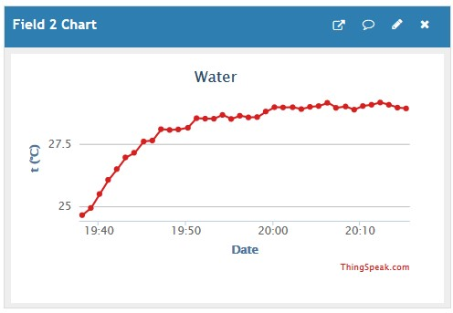
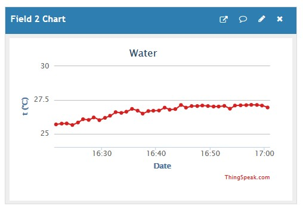

# Lesson learned: the temperature measurement

## The problem

In the prototype, the temperature measurement seemed quite accurate.

However, in the final setup, the measurement suffers from self-warming
of the electronics in the waterproof box containing the transmitter.

This can be seen from the following graph, copied from ThingSpeak.
The graph starts at power on and shows measurements at one minute intervals.
One can see a rise of the measured temperature of about 5°C during the warming up period,
while the ambient temperature can be assumed as good as constant...

It's important to find a solution for this, because we're using the measured
temperature to correct the water level measurement, which depends on the speed of sound,
which on its turn depends on the temperature...

## The solution

The obvious solution is to place the temperature sensor (U2) outside the box.
This needs to be done carefully, because the box needs to be waterproof.

I unmounted U2, extended its pins with wires,

put some heat shrink on it

and mounted it at the copper size of the printed circuit board.

I placed an extra gland in the bottom of the box,
matching the new position of U2 and mounted the printed circuit board,
so that U2 appeared through the gland.

I prepared a metal pipe with a diameter of 8 mm, open at one side

and open at the other side.

I put some thermal joint compound on U2

and finally, I put the pipe over U2 and tightened the gland.

The new bottom view of the box is as follows.

A new observation of the temperature measurement during warming up of the box
results in the following diagram.

Apparently, there is still some drift, but it is 4 times less and seems acceptable now.

