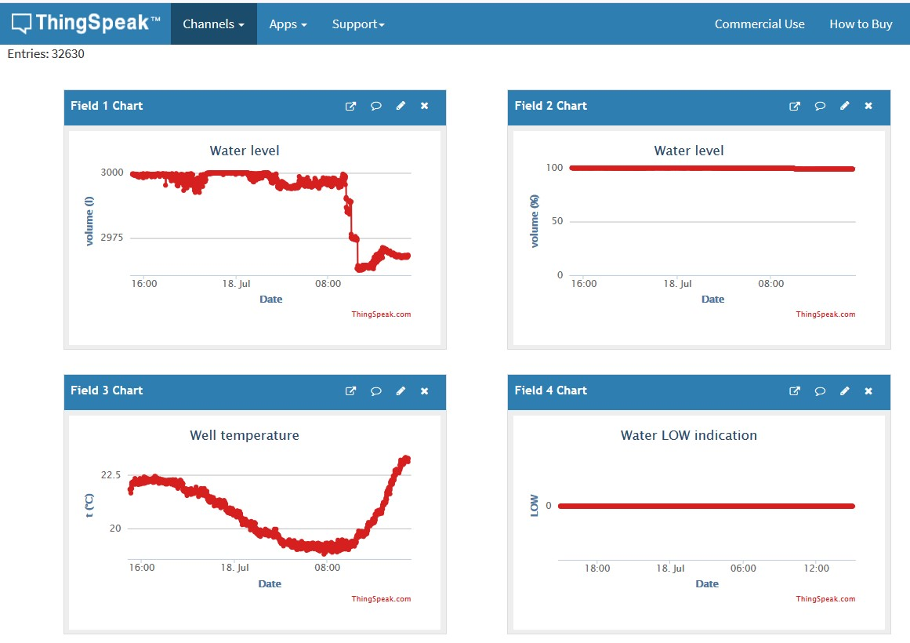

# The WaterLevelReceiver software

## Operation

Every second, the program sends a single "?" character to the Serial2 port, at 115200 Baud.
Each "?" acts as a request for a new measurement to the connected transmitter.
If all's well, the transmitter will reply with a JSON output as document in the [transmitter documentation](water-level-transmitter-software.md).

The receiver will decode this JSON payload and publish it to several destinations.
Currently, these are the supported destinations:
- the serial port accessible through the USB connection (at 115200 Baud);
- a character-based LCD display using the hd44780 chip;
- a channel on https://thingspeak.com.

## Serial port output

Serial port output consists of:
- the temperature in numerical form;
- the volume in liters in numerical form;
- the volume as percentage in numerical form;
- a LOW indicator, only written if the level is low.

-the decode values of the volume in liters, the volume as a percentage and the low indicator.

## LCD output

LCD output consist of:
- a representation of the volume as percentage in a bar graph;
- the volume as percentage in numerical form;
- the volume in liters in numerical form;
- a LOW indicator, only displayed if the level is low;
- a heartbeat indicator, changing between '*' and ' '.

## ThingSpeak output

The ThingSpeak API is accessed via WiFi using the Arduino library 'ThingSpeak'
and the output is directed to a specific channel, to be created by the user.

Output to the ThingSpeak channel is reduced to one write per minute.

The output in the channel consists of:
- a field (field 1) for the volume in liters;
- a field (field 2) for the volume as percentage;
- a field (field 3) for the temperature;
- a status (either "LOW" or "OK"), representing the LOW indicator.

For every successful write to ThingSpeak, the heartbeat indicator on the LCD output is overwritten with a '.'.

Note that in order to provide your personal secret values with respect to WiFi and ThingSpeak,
you must create your own secrets.h file, based on the instructions available in secrets_example.h.

### A note about the implementation of the ThingSpeak output

The WiFi is controlled using a state machine rather than the approach found in the WiFi
and ThingSpeak examples, in order to avoid the 5 seconds blocking found in these examples.
This is to guarantee the one second update interval for the other destinations.

## Testing

Some DEBUG... preprocesser definitions are available to assist debugging the code.
They provide possibilities to output debug information and to provide fake input.
